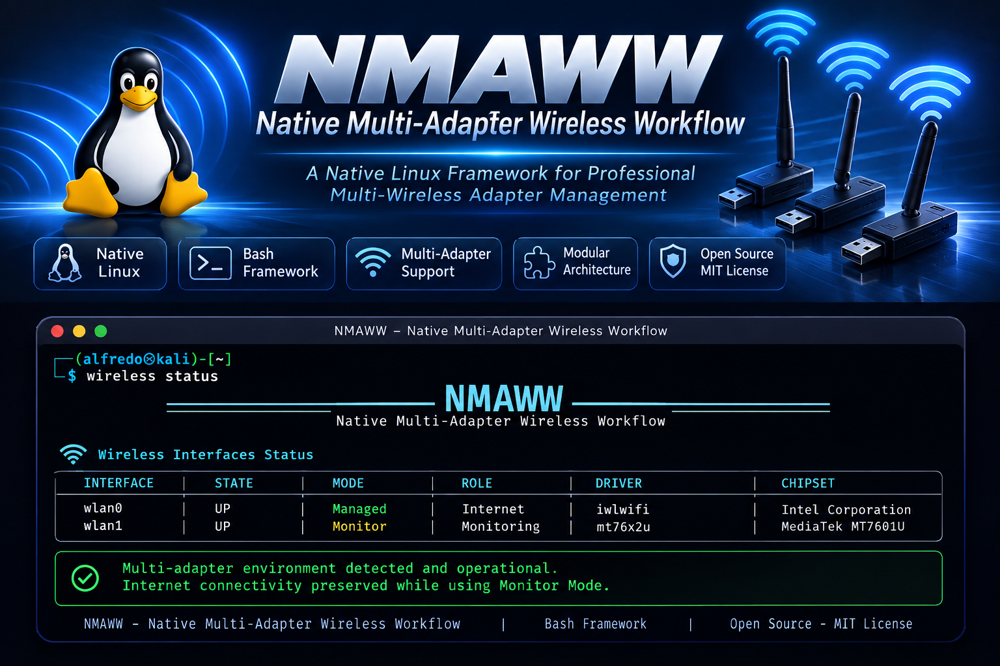
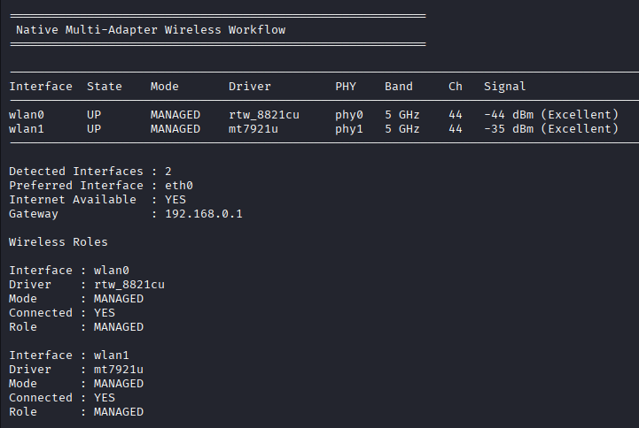

# Native Multi-Adapter Wireless Workflow (NMAWW)

### A Native Linux Framework for Professional Multi-Wireless Adapter Management

<p align="center">
  
</p>

<p align="center">


</p>

---

> **A modular orchestration framework that enables multiple wireless adapters to operate simultaneously under a unified Linux workflow.**

## Preview

<p align="center">
    
</p>

---

## At a Glance

| Feature | Status |
|----------|:------:|
| Native Linux | ✅ |
| Bash Framework | ✅ |
| Multi-Adapter Support | ✅ |
| Dynamic Command Loader | ✅ |
| Modular Architecture | ✅ |
| Professional Installer | ✅ |
| Open Source | ✅ |
| MIT License | ✅ |

# Table of Contents

- [Overview](#overview)
- [The Problem](#the-problem)
- [Why NMAWW?](#why-nmaww)
- [Project Vision](#project-vision)
- [Key Features](#key-features)
- [Design Principles](#design-principles)
- [Architecture](#architecture)
- [Installation](#installation)
- [Quick Start](#quick-start)
- [Repository Structure](#repository-structure)
- [Dynamic Command System](#dynamic-command-system)
- [Development](#development)
- [Roadmap](#roadmap)
- [Contributing](#contributing)
- [License](#license)
- [Author](#author)
- [Project Philosophy](#project-philosophy)
- [Acknowledgments](#acknowledgments)

# Overview

Native Multi-Adapter Wireless Workflow (NMAWW) is an open-source framework that introduces a unified operational layer for managing multiple wireless network adapters on Linux.

Rather than replacing existing wireless tools, NMAWW orchestrates them through a consistent, modular and extensible command-line interface.

The framework enables administrators, researchers and cybersecurity professionals to coordinate multiple wireless adapters simultaneously while keeping each interface operating independently in its assigned role.

Built entirely in Bash and based on native Linux networking utilities, NMAWW remains lightweight, transparent and easy to extend without introducing unnecessary dependencies.

The project is designed around a modular architecture that separates the framework core from operational commands, making long-term maintenance straightforward while encouraging community contributions.

Whether performing wireless assessments, network diagnostics, laboratory experimentation or security research, NMAWW provides a professional workflow for multi-adapter wireless operations under Linux.

# The Problem

Modern Linux systems fully support multiple wireless network adapters, allowing each interface to operate independently. However, users must manually coordinate every adapter, command and workflow.

A common wireless assessment may require one adapter connected to the Internet, another operating in monitor mode, and a third dedicated to packet capture. While Linux provides all the necessary capabilities, it does not provide a unified operational workflow to orchestrate these roles.

As projects grow in complexity, users often rely on custom scripts, terminal multiplexers and manual coordination, making wireless operations difficult to reproduce, maintain and scale.

NMAWW addresses this gap by introducing an orchestration layer that organizes multiple wireless adapters into a consistent, modular and extensible workflow while preserving the flexibility of native Linux networking tools.

# Why NMAWW?

Linux already provides excellent wireless capabilities, but it lacks a standardized workflow for coordinating multiple wireless adapters simultaneously.

NMAWW is not another wireless toolkit.

Instead, it acts as an orchestration framework that brings structure, consistency and modularity to complex multi-adapter environments while leveraging the power of native Linux networking utilities.

Its purpose is to simplify professional wireless operations without replacing existing tools, allowing users to build repeatable, scalable and maintainable workflows.


# Project Vision

NMAWW aims to establish a standardized operational framework for professional multi-wireless adapter management on Linux.

Rather than introducing new wireless technologies, the project builds a consistent orchestration layer on top of the native Linux networking stack, enabling complex wireless workflows to become modular, reproducible and easier to maintain.

Its long-term vision is to become a reference architecture for multi-adapter wireless operations, encouraging community collaboration, extensibility and adoption across cybersecurity, networking, education and research environments.

By remaining lightweight, transparent and entirely Bash-based, NMAWW embraces the Unix philosophy while providing a foundation that can evolve alongside the Linux ecosystem.

# Key Features

| Capability | Description |
|------------|-------------|
| Native Linux | Built entirely around native Linux networking capabilities. |
| Multi-Adapter Orchestration | Coordinates multiple wireless adapters under a unified operational workflow. |
| Modular Architecture | Framework core and commands remain completely separated. |
| Dynamic Command Loader | New commands become available without modifying the launcher. |
| Lightweight | Written entirely in Bash with minimal external dependencies. |
| Extensible | Designed for easy expansion through independent command modules. |
| Professional Installation | Includes an automated installer and clean uninstaller. |
| Open Source | Community-driven development under the MIT License. |

# Design Principles

| Principle | Description |
|-----------|-------------|
| Native First | Built on top of native Linux networking utilities without abstracting the operating system. |
| Modularity | Every command is implemented as an independent module. |
| Simplicity | Keep the framework lightweight, readable and easy to maintain. |
| Extensibility | New functionality can be added without modifying the framework core. |
| Transparency | Users always know which native Linux commands are being executed. |
| Reproducibility | Standardized workflows promote consistent and repeatable wireless operations. |
| Unix Philosophy | Do one thing well, compose modules and avoid unnecessary complexity. |

# Architecture

NMAWW is organized around a layered Core Service Architecture.

The architecture separates hardware discovery, capability detection, state management, role management, connectivity, network management, session handling, transaction management and workflow execution from the user-facing command layer.

```text
                           +--------------------------+
                           |      wireless CLI        |
                           |      bin/wireless        |
                           +------------+-------------+
                                        |
                                        v
                           +--------------------------+
                           |     Command Loader       |
                           | core/commands/loader.sh  |
                           +------------+-------------+
                                        |
                                        v
                    +------------------------------------------+
                    |                 Core                     |
                    |------------------------------------------|
                    | Bootstrap                                |
                    | Hardware Inventory                       |
                    | Capability Detection                     |
                    | State Management                         |
                    | Role Management                          |
                    | Connectivity                             |
                    | Network Management                       |
                    | Session Management                       |
                    | Transaction Management                   |
                    | Workflow Engine                          |
                    | Presentation                             |
                    +--------------------+---------------------+
                                         |
                                         v
                    +------------------------------------------+
                    |             Native Linux                 |
                    |------------------------------------------|
                    | ip | iw | nmcli | NetworkManager         |
                    | Linux wireless interfaces and drivers    |
                    +------------------------------------------+


---


# Installation

## Requirements

- Linux (recommended)
- Bash 5.x or newer
- Git
- Root privileges (for system-wide installation)

## Clone the Repository

```bash
git clone https://github.com/alfredosan-eng/Native-Multi-Adapter-Wireless-Workflow.git
cd Native-Multi-Adapter-Wireless-Workflow
```

## Make the Installer Executable

```bash
chmod +x install.sh uninstall.sh
```

## Install

```bash
sudo ./install.sh
```

## Verify Installation

```bash
wireless version
wireless status
```

The installer automatically:

- Validates system requirements
- Installs missing dependencies
- Creates the framework directory
- Installs the launcher
- Sets executable permissions
- Verifies the installation

# Quick Start

After installing NMAWW, the framework can be executed from any terminal location.

## Command Reference

| Command | Execution | Description |
|---|---|---|
| Version | `wireless version` | Display the current framework version. |
| Help | `wireless help` | Display available commands and usage information. |
| Status | `wireless status` | Show the current wireless environment, interface modes, connectivity and adapter roles. |
| Monitor | `sudo wireless monitor [interface]` | Enable Monitor Mode on the specified wireless interface. |
| Restore | `sudo wireless restore` | Restore the previous wireless session and networking environment. |

## Examples

Display the current framework version:

    wireless version

Display all available commands:

    wireless help

Show the current wireless environment:

    wireless status

Enable Monitor Mode on `wlan0`:

    sudo wireless monitor wlan0

Restore the previous wireless session:

    sudo wireless restore

During development, the framework can also be executed directly from the repository:

    ./bin/wireless help

NMAWW automatically discovers available command modules, allowing the framework to grow without modifying the launcher.

# Repository Structure

The project follows a modular architecture designed to separate the framework Core from user-facing commands.

```text
Native-Multi-Adapter-Wireless-Workflow/
│
├── bin/
│   └── wireless
│
├── core/
│   ├── bootstrap.sh
│   ├── capabilities.sh
│   ├── colors.sh
│   ├── common.sh
│   ├── config.sh
│   ├── connectivity.sh
│   ├── constants.sh
│   ├── hardware.sh
│   ├── logger.sh
│   ├── network.sh
│   ├── parsers.sh
│   ├── presentation.sh
│   ├── privilege.sh
│   ├── roles.sh
│   ├── session.sh
│   ├── state.sh
│   ├── transaction.sh
│   ├── utils.sh
│   ├── validation.sh
│   ├── version.sh
│   ├── workflow.sh
│   └── commands/
│       └── loader.sh
│
├── framework/
│   └── commands/
│       ├── help.sh
│       ├── monitor.sh
│       ├── restore.sh
│       ├── status.sh
│       └── version.sh
│
├── config/
├── docs/
│   ├── ARCHITECTURE/
│   └── TEST_REPORTS/
│
├── runtime/
├── scripts/
│   └── dev-shell
│
├── install.sh
├── VERSION
├── CHANGELOG.md
├── ROADMAP.md
├── LICENSE
└── README.md


# Dynamic Command System

NMAWW uses a dynamic command loading mechanism instead of a hardcoded command dispatcher.

User-facing command modules are located under:

```text
framework/commands/
```
# Development

NMAWW follows a modular development philosophy that prioritizes simplicity, maintainability and native Linux compatibility.

## Development Guidelines

- Keep modules independent and self-contained.
- Follow the `cmd_<command>()` naming convention.
- Reuse framework libraries whenever possible.
- Write readable, well-documented Bash code.
- Avoid unnecessary external dependencies.
- Preserve backward compatibility whenever feasible.

## Coding Standards

- Bash 5.x compatible
- Modular architecture
- POSIX-friendly where practical
- ShellCheck-compliant
- Consistent logging and error handling

## Project Goals

- Lightweight framework
- Native Linux integration
- Easy extensibility
- Predictable behavior
- Professional code quality

# Roadmap

The current development roadmap focuses on strengthening the framework architecture before expanding its capabilities.

| Version | Objective | Status |
|----------|-----------|:------:|
| v1.0 | Framework architecture and repository organization | ✅ |
| v1.1 | Additional wireless command modules | 🚧 |
| v1.2 | Automated testing framework | 📋 |
| v1.3 | Configuration management | 📋 |
| v1.4 | Plugin architecture | 📋 |
| v2.0 | Integration into the Kali Recovery Toolkit (KRT) ecosystem | 🔮 |

Future development will continue to prioritize modularity, maintainability and compatibility with native Linux networking technologies.

# Contributing

Contributions are welcome and encouraged.

Whether you are fixing bugs, improving documentation, proposing architectural enhancements or implementing new command modules, your contributions help the project evolve.

## Before Contributing

- Review the project architecture.
- Keep changes modular.
- Follow the established coding standards.
- Update documentation when necessary.
- Test your changes before submitting.

## Recommended Workflow

1. Fork the repository.
2. Create a feature branch.
3. Commit your changes using clear commit messages.
4. Push the branch to your fork.
5. Open a Pull Request describing the proposed changes.

The goal is to keep NMAWW clean, maintainable and easy for new contributors to understand.

# License

This project is distributed under the **MIT License**.

You are free to use, modify and distribute the software in accordance with the terms of the license.

See the [LICENSE](LICENSE) file for complete details.

---

# Author

Developed by the NMAWW Project.

NMAWW is an open-source initiative focused on improving native multi-wireless adapter workflows for Linux through a modular, lightweight and extensible architecture.

The project welcomes community participation, technical discussions and collaborative development.

---

# Project Philosophy

NMAWW is guided by a small set of principles that define every architectural decision made throughout the project.

- **Native** — Build upon Linux instead of replacing it.
- **Modular** — Independent components are easier to maintain and extend.
- **Lightweight** — Minimize complexity and unnecessary dependencies.
- **Transparent** — Users should always understand what the framework is doing.
- **Professional** — Favor clean architecture, documentation and consistency.
- **Extensible** — New capabilities should integrate naturally into the framework.
- **Open** — Community collaboration is essential for long-term evolution.

These principles ensure that NMAWW remains a practical, maintainable and future-proof framework for professional multi-adapter wireless operations.

# Acknowledgments

Special thanks to the Linux open-source community and to all developers whose work on the Linux networking stack, wireless utilities and open standards has made projects like NMAWW possible.
